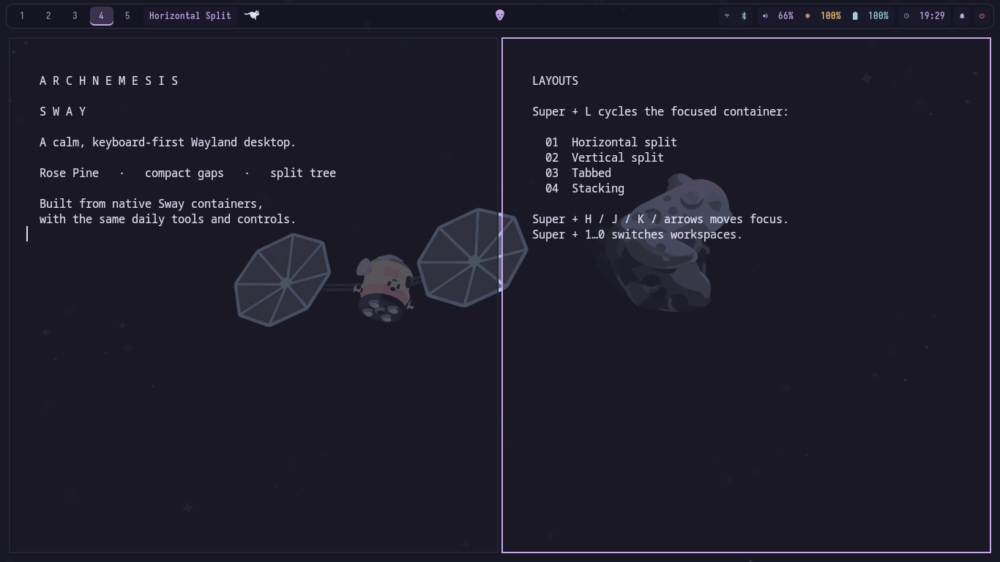
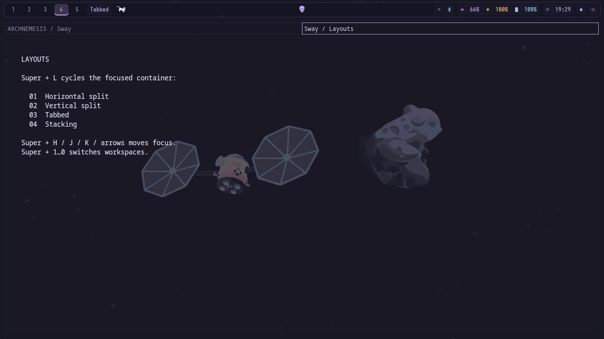
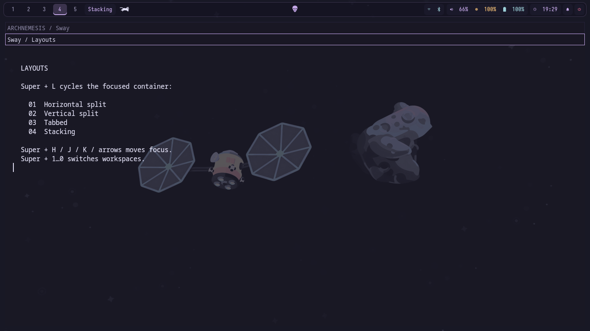
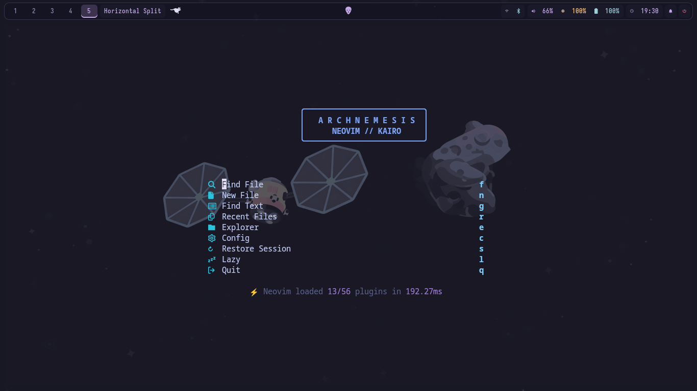

<div align="center">

# ARCHNEMESIS · Sway

**A familiar desktop, built around Sway’s split-tree workflow.**

Rosé Pine colors · compact gaps · Kitty · Helium · Dolphin · Rofi · Waybar



</div>

---

## Install

On a fresh setup, clone directly into Sway’s config directory:

```sh
git clone git@github.com:nihitdev/sway-config.git ~/.config/sway
```

Then select Sway from your display manager. The config does not change your login manager.

---

## See Sway’s layouts

Press **Super+L** to cycle the focused container through horizontal split, vertical split, tabbed, and stacked. The Waybar label shows the current container layout.

<details>
<summary>Tabbed layout</summary>
<br>

</details>

<details>
<summary>Stacked layout</summary>
<br>

</details>

<details>
<summary>Neovim start screen</summary>
<br>

</details>

---

## Daily controls

| Keys | Action |
| --- | --- |
| Super+Return / B / E / Space | Kitty / Helium / Dolphin / Rofi launcher |
| Super+G / N | Kdenlive / Kitty with Neovim |
| Super+W | Close focused window |
| Super+H/J/K and arrows | Directional focus |
| Super+L | Cycle Sway layouts |
| Super+1…0 | Switch workspaces 1–10 |
| Super+Shift+1…0 | Move focused container to a workspace |
| Super+S / Super+Shift+S | Show scratchpad / send container to scratchpad |
| Super+V | Rofi clipboard history |
| Alt+Z or Print / Shift+Print | Region / full screenshot |
| Super+Alt+Space / Super+Alt+L | Wallpaper picker / lock |
| Volume, brightness, media keys | `wpctl`, `brightnessctl`, `playerctl` |

---

## Layout

```text
config                 Sway entry point
modules/               bindings, input, appearance, apps, startup
scripts/               layout label, wallpaper, lock, power, startup
waybar.jsonc           Sway-specific modules
waybar.css             Rosé Pine styling
screenshots/            Desktop and workflow previews
```

The Waybar workspace buttons show the five persistent workspaces. Sway itself uses a split tree: **Super+L** changes the focused container’s layout rather than switching between compositor-wide layout engines.

---

## Existing tools

This config reuses Kitty, Helium, Dolphin, Rofi, Waybar, SwayNC, cliphist, and the existing wallpaper collection. The screenshot and lock scripts use shared helpers from `~/.config/hypr/`; those files are not copied here. Required programs and themes are not installed by this repo.

Sway provides square window borders and no compositor blur or animated transitions. The bar and its controls use rounded styling; window gaps, borders, and colors use Sway’s native options.
